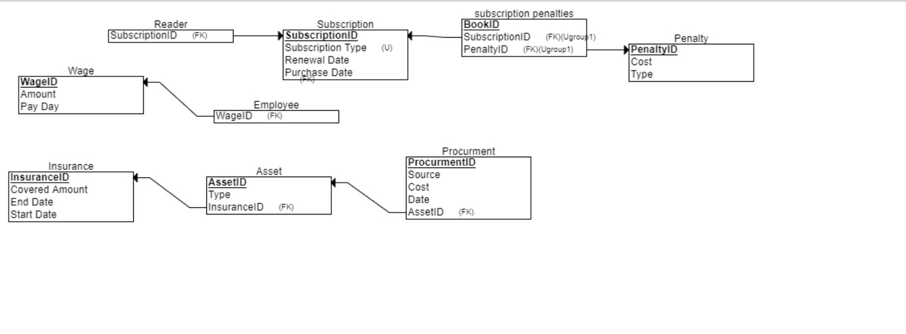
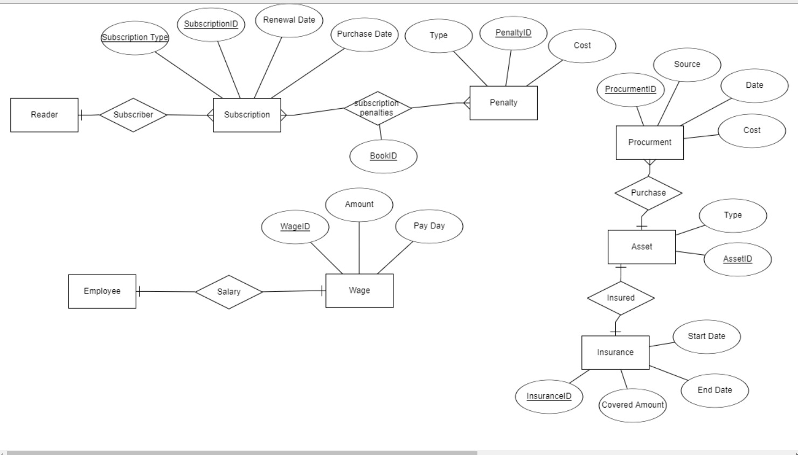

# Library Billing System

# STAGE 1

## Overview
This project represents a **Library Billing System** designed to track subscriptions, penalties, employee wages, assets, and procurement processes within a library. It focuses on managing the core aspects of library operations and their financial transactions.

---

## Features
- **Reader Management**: Track readers' subscriptions, renewals, and penalties.
- **Employee Management**: Manage employee wages, payroll, and compensation.
- **Asset Tracking**: Monitor physical library assets, including insurance and procurement.
- **Financial Tracking**: Record costs associated with penalties, procurement, and employee wages.

---

## Design Specifications and Entity Relationship Diagram

### Data Structure Diagram (DSD)
Below is the Data Structure Diagram (DSD) representing the logical flow and structure of the system:

**Data Structure Diagram**  

### Entity Relationship Diagram (ERD)
The following Entity Relationship Diagram (ERD) illustrates the relationships between the various entities in the system:

**Entity Relationship Diagram**  

---

## Entities and Relationships

### Entities
The system includes the following key entities:

- **Reader**: Represents an individual who subscribes to the library.
  - **Attributes**: `ReaderID` (Primary Key), `SubscriptionID` (Foreign Key)
  
- **Subscription**: Represents a subscription to the library's services.
  - **Attributes**: `SubscriptionID` (Primary Key), `Subscription Type`, `Renewal Date`, `Purchase Date`

- **Penalty**: Represents penalties associated with subscriptions (e.g., overdue fees, damage fees).
  - **Attributes**: `PenaltyID` (Primary Key), `Type`, `Cost`

- **Wage**: Represents employee wage details, including payment amount and payday.
  - **Attributes**: `WageID` (Primary Key), `Amount`, `Pay Day`

- **Employee**: Represents employees working in the library.
  - **Attributes**: `EmployeeID` (Primary Key), `WageID` (Foreign Key)

- **Asset**: Represents library assets, such as books, computers, or furniture.
  - **Attributes**: `AssetID` (Primary Key), `Type`, `InsuranceID` (Foreign Key)

- **Insurance**: Represents insurance policies covering assets.
  - **Attributes**: `InsuranceID` (Primary Key), `Covered Amount`, `Start Date`, `End Date`

- **Procurement**: Represents the procurement of assets.
  - **Attributes**: `ProcurementID` (Primary Key), `Source`, `Date`, `Cost`, `AssetID` (Foreign Key)

### Relationships
- **Reader to Subscription**: One-to-Many relationship (A reader can have one subscription, and a subscription can have many readers).
- **Subscription to Penalty**: Many-to-Many relationship (A subscription can incur multiple penalties, and a penalty can be applied to many subscriptions).
- **Employee to Wage**: One-to-One relationship (Each employee has one wage record).
- **Asset to Insurance**: One-to-One relationship (Each asset has one insurance policy).
- **Procurement to Asset**: One-to-Many relationship (An asset may be procured multiple times).

---

## Design Rationale

### Why These Entities Were Chosen
The design of the Library Billing System is centered around the essential operations of the library, ensuring efficient management and tracking of both financial and operational data.

- **Reader**: This entity tracks individuals who interact with the library's services. The reader’s subscription details are essential for determining billing and penalties.
- **Subscription**: Subscriptions define the reader’s relationship with the library and are crucial for tracking renewal dates and managing service usage.
- **Penalty**: Penalties are needed to enforce library rules and track costs incurred due to overdue or damaged items.
- **Employee and Wage**: Employees are central to library operations, and tracking wages is necessary for payroll and compensation purposes.
- **Asset and Insurance**: Assets represent library property, and insurance coverage is necessary for risk management.
- **Procurement**: This entity is critical for tracking new acquisitions and maintaining inventory levels.

### How the Entities and Relationships Work Together
The system’s design facilitates the efficient management of the library’s core functions:
- **Reader and Subscription** are linked to track each reader's active subscription.
- **Subscription and Penalty** work together to manage penalties associated with overdue or damaged items.
- **Employee and Wage** are linked to ensure proper compensation and payroll management.
- **Asset** is associated with **Insurance** to ensure that each asset is covered.
- **Procurement** manages the library’s acquisition of assets.

---

## Use Cases
The Library Billing System supports the following use cases:
- **Subscription Management**: Library administrators can track reader subscriptions, renewals, and penalties.
- **Employee Payroll**: Administrators can manage employee wages, ensuring timely payments.
- **Asset Management**: Keep track of library assets and their associated insurance coverage.
- **Procurement Process**: Record details about the acquisition of new assets and track procurement costs.

---

## Target Users
- **Library Administrators**: They will manage subscriptions, penalties, employee wages, and assets.
- **Employees**: Employees can view their wage records and interact with the system for asset-related tasks.
- **Readers**: Readers' information will be managed through their subscriptions and penalties.

---

## Data Population Process

### Overview
The data population script generates random data for multiple tables using the **Faker** library and inserts it into the PostgreSQL database using **psycopg2**. The script populates data for tables such as **Insurance**, **Wage**, **Penalty**, **Subscription**, **Reader**, **Asset**, **Employee**, **Procurement**, and **SubscriptionPenalties**.

### Tables Populated:
1. **Insurance** - Populates insurance coverage details.
2. **Wage** - Populates wage details for employees.
3. **Penalty** - Populates penalty types and costs.
4. **Subscription** - Populates subscription information.
5. **Reader** - Populates information about readers, including subscription IDs.
6. **Asset** - Populates different asset types, like buildings, books, and computers.
7. **Employee** - Populates employee details associated with wage IDs.
8. **Procurement** - Populates procurement information from vendors.
9. **SubscriptionPenalties** - Populates many-to-many relationships between subscriptions and penalties.

### Data Size:
The script populates the following number of records for each table:
- **Wage**: 200,000 rows
- **Penalty**: 200,000 rows
- **Subscription**: 100,000 rows
- **Reader**: 200,000 rows
- **Asset**: 200,000 rows
- **Employee**: 200,000 rows
- **Procurement**: 1,000 rows
- **SubscriptionPenalties**: 200,000 rows
- **Insurance**: 200,000 rows

**Total Records**: 1,501,000

