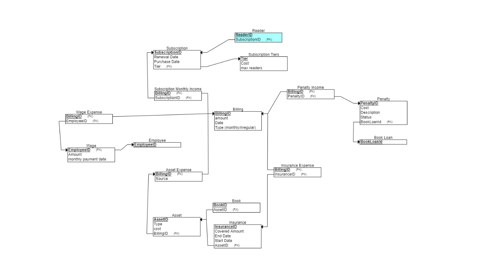
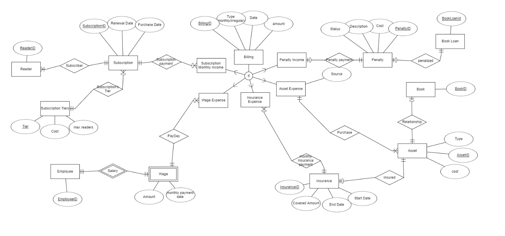

# Library Billing System

# STAGE 1

## Project Overview

This project represents a **Library Billing System** designed to track subscriptions, penalties, employee wages, assets, and procurement processes within a library. It focuses on managing the core aspects of library operations and their financial transactions.

---

## Features

- **Reader Management**: Track readers' subscriptions, renewals, and penalties.
- **Employee Management**: Manage employee wages, payroll, and compensation.
- **Asset Tracking**: Monitor physical library assets, including insurance and procurement.
- **Financial Tracking**: Record costs associated with penalties, procurement, and employee wages.

---

## Design Specifications and Entity Relationship Diagram

### Data Structure Diagram (DSD)

Below is the Data Structure Diagram (DSD) representing the logical flow and structure of the system:

**Data Structure Diagram**  

### Entity Relationship Diagram (ERD)

The following Entity Relationship Diagram (ERD) illustrates the relationships between the various entities in the system:

**Entity Relationship Diagram**  

---

## Entities and Relationships

### Entities

The system includes the following key entities:

# Library Database Schema

This database schema represents a comprehensive library management system that includes subscriptions, billing, penalties, asset management, and more.

## Tables Overview

- **Reader**: Represents an individual who subscribes to the library.
  - **Attributes**: `ReaderID` (Primary Key), `SubscriptionID` (Foreign Key)

- **Subscription**: Tracks library subscription details.
  - **Attributes**: `SubscriptionID` (Primary Key), `Renewal_Date`, `Purchase_Date`, `Tier` (Foreign Key)

- **Subscription_Tiers**: Defines different subscription plans offered by the library.
  - **Attributes**: `Tier` (Primary Key), `Cost`, `max_readers`

- **Employee**: Represents a library employee.
  - **Attributes**: `EmployeeID` (Primary Key)

- **Wage**: Tracks wages paid to employees.
  - **Attributes**: `Amount`, `monthly_payment_date`, `EmployeeID` (Primary Key and Foreign Key)

- **Wage_Expense**: Links employee wages to billing records.
  - **Attributes**: `BillingID` (Primary Key, Foreign Key), `EmployeeID` (Foreign Key)

- **Book**: Represents books in the library.
  - **Attributes**: `BookID` (Primary Key), `AssetID` (Foreign Key)

- **Book_Loan**: Tracks loans of books to readers.
  - **Attributes**: `BookLoanId` (Primary Key)

- **Penalty**: Represents penalties incurred by readers for overdue or damaged books.
  - **Attributes**: `PenaltyID` (Primary Key), `Cost`, `Description`, `Status`, `BookLoanId` (Foreign Key)

- **Penalty_Income**: Links penalties to billing records.
  - **Attributes**: `BillingID` (Primary Key, Foreign Key), `PenaltyID` (Foreign Key)

- **Billing**: Tracks all financial transactions in the library.
  - **Attributes**: `BillingID` (Primary Key), `amount`, `Date`

- **Asset**: Represents physical assets owned by the library.
  - **Attributes**: `AssetID` (Primary Key), `Type`, `cost`, `BillingID` (Foreign Key)

- **Asset_Expense**: Links assets to billing records.
  - **Attributes**: `Source`, `BillingID` (Primary Key and Foreign Key)

- **Insurance**: Tracks insurance policies for library assets.
  - **Attributes**: `InsuranceID` (Primary Key), `Covered_Amount`, `EndDate`, `StartDate`, `AssetID` (Foreign Key)

- **Insurance_Expense**: Links insurance policies to billing records.
  - **Attributes**: `BillingID` (Primary Key and Foreign Key), `InsuranceID` (Foreign Key)

- **Subscription_Monthly_Income**: Tracks income from subscription renewals.
  - **Attributes**: `BillingID` (Primary Key and Foreign Key), `SubscriptionID` (Foreign Key)

---

## Design Rationale

### Why These Entities Were Chosen

The design of the Library Billing System is centered around the essential operations of the library, ensuring efficient management and tracking of both financial and operational data.

- **Reader**: This entity tracks individuals who interact with the library's services. The reader’s subscription details are essential for determining billing and penalties.
- **Subscription**: Subscriptions define the reader’s relationship with the library and are crucial for tracking renewal dates and managing service usage.
- **Penalty**: Penalties are needed to enforce library rules and track costs incurred due to overdue or damaged items.
- **Employee and Wage**: Employees are central to library operations, and tracking wages is necessary for payroll and compensation purposes.
- **Asset and Insurance**: Assets represent library property, and insurance coverage is necessary for risk management.
- **Procurement**: This entity is critical for tracking new acquisitions and maintaining inventory levels.

---

## Relationships

1. **Reader ↔ Subscription**
   - A **Reader** is part of a **Subscription** that can have multiple readers.
   - Links readers to their active or previous subscriptions.

2. **Subscription ↔ Subscription Tiers**
   - A **Subscription** belongs to a specific **Subscription Tier**.
   - Defines different subscription plans based on cost and maximum number of readers.

3. **Subscription ↔ Billing**
   - Each **Subscription Payment** contributes to **Subscription Monthly Income** tracked under **Billing**.

4. **Penalty ↔ Billing**
   - Penalties are recorded in **Penalty Income** under **Billing**.
   - The **Penalty** entity tracks details such as status, description, cost, and penalty payment.

5. **Penalty ↔ Book Loan**
   - A **Penalty** is associated with a **Book Loan** (e.g., overdue fines or damages).

6. **Asset ↔ Billing**
   - Expenses for **Assets** are recorded under **Asset Expense** in **Billing**.
   - Represents costs incurred by purchasing or maintaining assets.

7. **Book ↔ Asset**
   - A **Book** is a **Asset** that belongs to the library (e.g., purchased as part of the library's inventory).
   - Represents the library's physical collection.

8. **Employee ↔ Wage**
   - An **Employee** receives a **Wage**.
   - Represents the library's staff and their associated salary payments.

9. **Wage ↔ Billing**
    - Wages paid to employees are recorded as **Wage Expense** in **Billing**.

10. **Insurance ↔ Billing**
    - Payments for **Insurance** are recorded under **Insurance Expense** in **Billing**.
    - Allows tracking of regular insurance payments for covered items, rooms, or the building.

11. **Asset ↔ Insurance**
    - An **Asset** can be **Insured**.
    - Represents coverage for valuable library assets.

12. **Insurance ↔ Billing**
    - The **Insurance Expense** links payments for monthly insurance premiums to **Billing**.

13. **Billing** has a with various expense and income categories:
    1. **Subscription Monthly Income**: Captures income from subscriptions.
    2. **Penalty Income**: Captures income from penalties.
    3. **Asset Expense**: Captures expenses for purchasing or maintaining assets.
    4. **Wage Expense**: Captures expenses related to employee wages.
    5. **Insurance Expense**: Captures expenses related to library insurance.

---

## Use Cases

The Library Billing System supports the following use cases:

- **Subscription Management**: Library administrators can track reader subscriptions, renewals, and penalties.
- **Employee Payroll**: Administrators can manage employee wages, ensuring timely payments.
- **Asset Management**: Keep track of library assets and their associated insurance coverage.
- **Billing Process**: Record details about the acquisition of new assets and incomes, as well as recording the library's expenses.

---

## Target Users

- **Library Administrators**: They will manage subscriptions, penalties, employee wages, and assets.
- **Employees**: Employees can view their wage records and interact with the system for asset-related tasks.
- **Readers**: Readers' information will be managed through their subscriptions and penalties.

---

## Data Population Process

### Data Population Overview

The data population script generates random data for multiple tables using the **Faker** library and inserts it into the PostgreSQL database using **psycopg2**. The script populates data for tables such as **Insurance**, **Wage**, **Penalty**, **Subscription**, **Reader**, **Asset**, **Employee** and more.

### Tables Populated

1. **Subscription** - Tracks subscription plans for readers, including renewal and purchase dates, and the subscription tier.  
2. **Subscription Tiers** - Defines various subscription levels, specifying their cost and the maximum number of readers allowed.  
3. **Billing** - Records financial transactions, including subscription payments, penalties, and other expenses.  
4. **Subscription Monthly Income** - Links subscriptions to their corresponding monthly billing entries.  
5. **Penalty** - Details penalties issued for late returns or damaged books, including cost and description.  
6. **Penalty Income** - Tracks penalties collected through billing records.  
7. **Asset** - Tracks library-owned items, including books, equipment, or other resources, with associated costs.  
8. **Asset Expense** - Records expenses related to library assets and their sources.  
9. **Insurance** - Details insurance policies for library assets, including covered amounts and policy periods.  
10. **Insurance Expense** - Tracks insurance costs paid for assets, linked to billing records.  
11. **Wage** - Tracks employee wages and payment dates.  
12. **Wage Expense** - Records wage payments linked to the billing system.  

(the following are tables that are managed by other teams)
13. **Book** - Maintains details about library books, including their associated assets.  
14. **Reader** - Stores information about individual readers, including their subscription details.  
15. **Employee** - Stores employee data, including identifiers and wage details.  
16. **Book Loan** - Represents information about books borrowed by readers.  

### Data Size

The script populates the following number of records for each table:

- **employees** = 100
- **book_loans** = 20,000
- **billings** = 2,000,000
- **asset_expenses** = 15,000
- **subscription_tiers** = 5
- **subscriptions** = 20,000
- **penalties** = 9,000
- **readers** = 35,000
- **wages** = 100
- **assets** = 20,000
- **penalty_income** = 8,000
- **subscription_monthly_income** = 25,000
- **wage_expense** = 900
- **books** = 15,000
- **insurances** = 12,000

**Total Records**: 2,180,105
