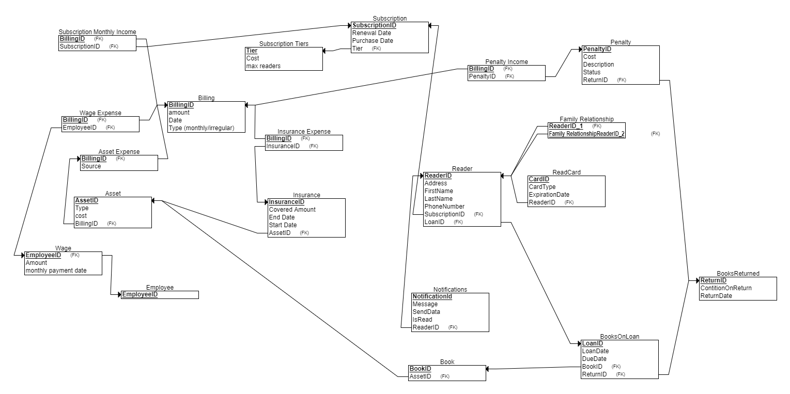

# Library Billing System 4

## ERD

### original ERD

difficulty: the relationship between `penalty` and book loans, is it related to a book loan or a book returned?


### new ERD for  for Readers


### merged ERD


### json files

merged JSON: [merged.json](./merged.json)

Original JSON: [original.json](./original.json)

new JSON: [new.json](./new.json)

### merged DSD



### craete tables

``` sql
create table employee
(
  employeeid int not null,
  primary key (employeeid)
);

create table booksreturned
(
  returnid int not null,
  contitiononreturn int not null,
  returndate int not null,
  primary key (returnid)
);

create table billing
(
  amount int not null,
  date int not null,
  type_(monthly/irregular) int not null,
  billingid int not null,
  primary key (billingid)
);

create table asset_expense
(
  source int not null,
  billingid int not null,
  primary key (billingid),
  foreign key (billingid) references billing(billingid)
);

create table subscription_tiers
(
  tier int not null,
  cost int not null,
  max_readers int not null,
  primary key (tier)
);

create table subscription
(
  subscriptionid int not null,
  renewal_date int not null,
  purchase_date int not null,
  tier int not null,
  primary key (subscriptionid),
  foreign key (tier) references subscription_tiers(tier)
);

create table penalty
(
  cost int not null,
  penaltyid int not null,
  description int not null,
  status int not null,
  returnid int not null,
  primary key (penaltyid),
  foreign key (returnid) references booksreturned(returnid)
);

create table wage
(
  amount int not null,
  monthly_payment_date int not null,
  employeeid int not null,
  primary key (employeeid),
  foreign key (employeeid) references employee(employeeid)
);

create table asset
(
  assetid int not null,
  type int not null,
  cost int not null,
  billingid int not null,
  primary key (assetid),
  foreign key (billingid) references asset_expense(billingid)
);

create table penalty_income
(
  billingid int not null,
  penaltyid int not null,
  primary key (billingid),
  foreign key (billingid) references billing(billingid),
  foreign key (penaltyid) references penalty(penaltyid)
);

create table subscription_monthly_income
(
  billingid int not null,
  subscriptionid int not null,
  primary key (billingid),
  foreign key (billingid) references billing(billingid),
  foreign key (subscriptionid) references subscription(subscriptionid)
);

create table wage_expense
(
  billingid int not null,
  employeeid int not null,
  primary key (billingid),
  foreign key (billingid) references billing(billingid),
  foreign key (employeeid) references wage(employeeid)
);

create table book
(
  bookid int not null,
  assetid int not null,
  primary key (bookid),
  foreign key (assetid) references asset(assetid)
);

create table booksonloan
(
  loanid int not null,
  loandate int not null,
  duedate int not null,
  bookid int not null,
  returnid int not null,
  primary key (loanid),
  foreign key (bookid) references book(bookid),
  foreign key (returnid) references booksreturned(returnid)
);

create table reader
(
  readerid int not null,
  address int not null,
  firstname int not null,
  lastname int not null,
  phonenumber int not null,
  subscriptionid int not null,
  loanid int not null,
  primary key (readerid),
  foreign key (subscriptionid) references subscription(subscriptionid),
  foreign key (loanid) references booksonloan(loanid)
);

create table insurance
(
  insuranceid int not null,
  covered_amount int not null,
  end_date int not null,
  start_date int not null,
  assetid int not null,
  primary key (insuranceid),
  foreign key (assetid) references asset(assetid)
);

create table insurance_expense
(
  billingid int not null,
  insuranceid int not null,
  primary key (billingid),
  foreign key (billingid) references billing(billingid),
  foreign key (insuranceid) references insurance(insuranceid)
);

create table readcard
(
  cardid int not null,
  cardtype int not null,
  expirationdate int not null,
  readerid int not null,
  primary key (cardid),
  foreign key (readerid) references reader(readerid)
);

create table notifications
(
  notificationid int not null,
  message int not null,
  senddata int not null,
  isread int not null,
  readerid int not null,
  primary key (notificationid),
  foreign key (readerid) references reader(readerid)
);

create table family_relationship
(
  readerid_1 int not null,
  family_relationshipreaderid_2 int not null,
  primary key (readerid_1, family_relationshipreaderid_2),
  foreign key (readerid_1) references reader(readerid),
  foreign key (family_relationshipreaderid_2) references reader(readerid)
);
```

## database merging

### pg_restore
``` powershell
pg_restore -u postgres -h localhost -v -d "library billing system" -f c --if-exists --clean .\backuppsql.sql 2> restorepsql.log
```

### update the book loan ids in penalty

replacing the loan ids in the penalty table to match the real data

``` sql
with return_ids as (
select returnid, row_number() over () as rn from (
	select * 
	from booksreturned 
	order by random() 
	limit (select count(*) from penalty)
	)
),
penalty_ids as (
    select penaltyid, row_number() over () as rn from penalty
),
updated_penalties as (
    select p.penaltyid as penalty_id, r.returnid as new_return_id
    from penalty_ids p
    join return_ids r on p.rn = r.rn
)
update penalty
set bookloanid = up.new_return_id
from updated_penalties up
where penalty.penaltyid = up.penalty_id;
```

### adding subscriptionid to reader table

added column to reader table
``` sql
alter table readers
add column subscriptionid int references subscription(subscriptionid) on delete set null;
```

created a python script to add subscription ids to the reader table:

python script: [reader_subscription.py](./readers_subscription.py)

second run with fixes: [fix_reader_subscription.py](./fix_readers_subscription.py)

set all subscriptions without readers to cancelled
``` sql
update subscription
set tier = 'cancelled'
where subscriptionid not in (select distinct subscriptionid from readers where subscriptionid is not null);
```

## views

### subscription reader view

**purpose:** show the subscriptions that readers are subscribed to

``` sql
create view subscriptionreaders as
select
	r.readerid, 
	r.firstname, 
	r.lastname,
	r.address,
	r.phonenumber,
	s.subscriptionid,
	s.renewal_date,
	s.purchase_date,
	s.tier
from
	readers r
	join subscription s on r.subscriptionid = s.subscriptionid;
```

#### select query

get the `subscription tier` of `'kimberly torres'`

``` sql
select tier from subscriptionreaders
where firstname = 'kimberly' and lastname = 'torres'
```

result:

``` text
 tier
-------
 basic
(1 row)

time: 13.847 ms
```

#### update query

some of the subscriptions had 2 readers so i changed their tiers to `premium`

``` sql
update subscription
set tier = 'premium'
where subscriptionid in (select subscriptionid 
	from (select count(*) c, subscriptionid, tier
				from subscriptionreaders
				where tier != 'family' 
				group by subscriptionid, tier) 
	where c > 1)
```

result:

``` text
update 829
time: 76.764 m
```

### view loan status

**purpose:** show the loan status of the books per reader

``` sql
create view readerloanstatus as
select
	r.readerid, 
	r.subscriptionid,
	bl.loanid,
	bl.bookid,
	bl.loandate,
	bl.duedate,
	br.returnid,
	br.conditiononreturn,
	br.returndate
from
	readers r
    join booksonloan bl on r.readerid = bl.readerid
    full join booksreturned br on bl.loanid = br.loanid
```

### select query

selects book load where the return condition is `poor`

```sql
select readerid from readerloanstatus
where conditiononreturn = 'poor'
group by readerid
```

result: 

``` text
readerid
----------
    11233
	...
time: 140.859 ms
```

### update query

inserts into the `bookreturned` table a new book return

``` sql
 insert into booksreturned (loanid, conditiononreturn, returndate)
values (
       (select loanid from readerloanstatus
       where subscriptionid = 26927 and bookid = 44140
       limit 1),
       'good',
       '2025-02-02');
```

result:

``` text
insert 0 1
time: 7.914 ms
```

## queries

### select on first view

get the names of all readers that have `peremium` subscriptions

``` sql
select firstname, lastname
from subscriptionreaders
where tier = 'premium'
```

result:

``` text
 firstname  |  lastname
-------------+-------------
 paul        | villarreal
 michael     | james
 ...
 time: 245.010 ms
```

### update on first view

inserts a new reader into the `reader` table only if the subscription is not full yet

``` sql
do
$do$
begin
   if exists (select count(*),sr.tier 
   			from subscriptionreaders sr
			join subscription_tiers st on st.tier = sr.tier
			where subscriptionid = 29
			group by sr.tier
			
   	) then
	   insert into readers (firstname,lastname, address, phonenumber,subscriptionid)
	   values ('jack', 'jackson', 'london', '477-233-1380', 29);
   end if;
end
$do$
```

result:

``` text
time: 19.194 ms
```

### select second view

gets all the loaned books that where returned by readers that their `subscriptionid` is 29

``` sql
select count(*), t.subscriptionid,  s.tier
from (select returnid, loanid, subscriptionid 
	from readerloanstatus rls
	where subscriptionid = 29 
	group by returnid, loanid, subscriptionid) t
join subscription s on s.subscriptionid = t.subscriptionid
where returnid is not null
group by t.subscriptionid, s. tier
```

result:

``` text
 count | subscriptionid |  tier
-------+----------------+--------
    10 |             29 | family
(1 row)


time: 6.809 ms
```

### insert second view

adds a penalty to the penalty table with values from the returned table,
it adds a penalty to a loan that its duedate is 2024-12-17 with subscriptionid 29, it adds a bookreturn 'damaged' and a penalty of `lost item fee` 

``` sql
 with bookreturn as (
insert into booksreturned (loanid, conditiononreturn, returndate)
select t.loanid, 'damaged', '2025-01-30'
from (select *
       from readerloanstatus rls
       where subscriptionid = 29 and duedate = '2024-12-17') t
where returnid is null
limit 1
returning returnid, loanid
)
insert into penalty (cost, description, status, penalty_type, bookloanid)
select cost, 'book lost', 0, 'lost item fee', returnid
from bookreturn br
join booksonloan bol on bol.loanid = br.loanid
join book b on b.bookid = bol.bookid
join asset a on a.assetid = b.assetid;
```

result

``` text
time: 10.183 ms
insert 0 4
```