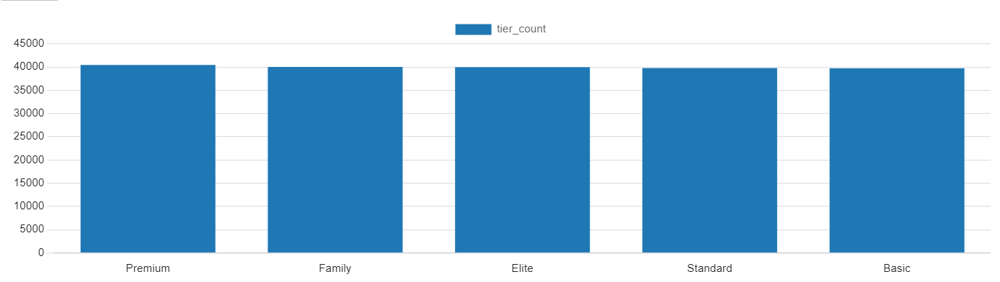

# Library Billing System - Stage 3


# SQL Queries Documentation

## Queries

### 1. Employee Wage Update
```sql
-- Query 1: Update Wages of Employees Based on Their Role and amount of payments received
UPDATE Wage w
SET Amount = Amount + 100
WHERE (SELECT count(*)
       FROM Billing b2
       JOIN wage_expense we ON b2.BillingID = we.BillingID
       JOIN employee e ON w.EmployeeID = e.EmployeeID
       WHERE w.EmployeeID = we.EmployeeID) > 5;
```
**Purpose**: Increases wages by $100 for employees who have received more than 5 payments.
**Timing**: 481.753 ms


### 2. Maxed-Out Subscriptions Query
```sql
-- Query 2: Get all subscriptions that are maxed out in readers
SELECT * 
FROM (
    SELECT s.SubscriptionID, (st.max_readers - count(r.readerid)) dif
    FROM Subscription s
    JOIN Subscription_Tiers st ON s.tier = st.tier
    JOIN reader r on r.SubscriptionID = s.SubscriptionID
    GROUP BY s.subscriptionID, st.max_readers
)
WHERE dif = 0;
```
**Purpose**: Identifies subscriptions that have reached their maximum reader limit.
**Timing**: 126.125 ms


### 3. Financial Summary Query
```sql
-- Query 3: Get total incomes and expenses
WITH IncomeCounts AS (
    SELECT count(amount) as income
    FROM Billing b
    INNER JOIN subscription_monthly_income smi on smi.BillingID = b.BillingID
    UNION
    SELECT count(amount) as income
    FROM Billing b
    INNER JOIN penalty_income pi on pi.BillingID = b.BillingID
),
ExpenseCounts AS (
    SELECT count(amount) as expense
    FROM Billing b
    INNER JOIN insurance_expense ie on ie.BillingID = b.BillingID
    UNION
    SELECT count(amount) as expense
    FROM Billing b
    INNER JOIN wage_expense we on we.BillingID = b.BillingID
    UNION
    SELECT count(amount) as expense
    FROM Billing b
    INNER JOIN asset_expense ae on ae.BillingID = b.BillingID
)
SELECT 
    (SELECT SUM(income) FROM IncomeCounts) AS TotalIncome,
    (SELECT SUM(expense) FROM ExpenseCounts) AS TotalExpense;
```
**Purpose**: Calculates total income and expenses across all financial categories.
**Timing**: 733.398 ms

# SQL View Documentation

## Views

### 1. BillingCurrentMonth
```sql
CREATE VIEW BillingCurrentMonth AS
SELECT *
FROM Billing b
WHERE b.date > '2024-12-1' AND b.date < '2025-01-01';
```
**Purpose**: Filters billing records for a certain month

#### Operations
**Select Query**:
```sql
SELECT bcm.billingID, amount, date
FROM BillingCurrentMonth bcm 
JOIN Insurance_Expense ie ON bcm.BillingID = ie.BillingID 
UNION ALL 
SELECT bcm.billingID, amount, date 
FROM BillingCurrentMonth bcm 
JOIN asset_expense ae ON bcm.BillingID = ae.BillingID 
UNION ALL 
SELECT bcm.billingID, amount, date 
FROM BillingCurrentMonth bcm 
JOIN Wage_Expense we ON bcm.BillingID = we.BillingID;
```

**Time**: 109.481 ms


**Update Query**:
```sql
UPDATE BillingCurrentMonth bcm 
SET amount = amount + 100 
WHERE exists (SELECT * FROM wage_expense we WHERE we.BillingID = bcm.BillingID);
```
**Purpose**: Giving a bonus to all employees this month. 
**Time**: 78.992 ms

### 2. DamageFeePenalty
```sql
CREATE VIEW DamageFeePenalty AS
SELECT *
FROM Penalty p
WHERE p.penalty_type = 'Damage Fee';
```
**Purpose**: Isolates damage fee penalties

#### Operations
**Select Query**:
```sql
SELECT * FROM DamageFeePenalty dfp
WHERE dfp.cost > 20;
```
**Time**: 26.741 ms 

**Update Query**:
```sql
UPDATE DamageFeePenalty dfp
SET status = 1
WHERE dfp.penaltyID = 5;
```
**Time**: 9.226 ms

### 3. HighWages
```sql
CREATE VIEW HighWages AS
SELECT *
FROM Wage w
WHERE w.amount > 3070;
```
**Purpose**: Identifies high-wage employees

#### Operations
**Select Query**:
```sql
SELECT *
FROM HighWages
WHERE monthly_payment_date = 10;
```
Time: 13.914 ms

**Delete Query**:
```sql
DELETE FROM HighWages;
```
**Time**: 2.593 ms

### 4. ExpensiveAssets
```sql
CREATE VIEW ExpensiveAssets AS
SELECT *
FROM Asset a
WHERE a.cost > 400;
```
**Purpose**: Tracks high-value assets
**Base Table**: Asset
**Filter Criteria**: cost > 400

#### Operations
**Select Query**:
```sql
SELECT * FROM ExpensiveAssets ea
WHERE ea.type = 'Computer';
```
**Time**: 30.261

**Update Query**:
```sql
UPDATE ExpensiveAssets ea
SET ea.cost = 499
WHERE ea.cost = 500;
```
**Time**: 40.342

# SQL Functions Documentation

## Functions

### 1. add_bonus


```sql
CREATE or replace  function add_bonus(bonus int, seniority int)
RETURNS void
language plpgsql
AS
$$
BEGIN
       UPDATE Wage w
       SET
               Amount = Amount + bonus

       WHERE (SELECT count(*)
               FROM Billing b2
                       JOIN
            wage_expense we ON b2.BillingID = we.BillingID
            JOIN
            employee e ON w.EmployeeID = e.EmployeeID
            WHERE w.EmployeeID = we.EmployeeID) > seniority;
end;
$$;
```

**Purpose**: Adds a bonus amount to employee wages based on seniority (number of paychecks received)
**Time**: 136.915 ms

### 2. readersInSub
```sql
CREATE or replace  function readersInSub(Subscription_ID int)
RETURNS int
language plpgsql
AS
$reader_count$
DECLARE
    reader_count int;
BEGIN
        SELECT count(*) reader_count INTO reader_count
        FROM
        reader r
        WHERE r.SubscriptionID = Subscription_ID;
        return reader_count;
end;
$reader_count$;

```
**Purpose**: Counts the number of readers associated with a specific subscription
**Time**: 147.897 ms

### 3. highWage
```sql
CREATE or replace  function highWage(my_amount NUMERIC(10, 2))
RETURNS table (wage_amount NUMERIC(10, 2), wage_employeeid int)
language plpgsql
AS
$$
BEGIN
        RETURN QUERY
        SELECT w.amount::NUMERIC(10, 2), w.employeeid
        FROM Wage w
        WHERE w.amount > my_amount;
end;
$$;

```

**Purpose**: Returns the highest paid employees
**Time**: 191.369 ms


### 4. billingByDate
```sql
CREATE or replace  function billingByDate(startDate DATE, endDate DATE)
RETURNS table (billing_amount NUMERIC(10,2), billing_date DATE, billing_billingID INT)
language plpgsql
AS
$$
BEGIN
        RETURN QUERY
        SELECT b.amount::NUMERIC(10,2), b.date, b.billingID
        FROM Billing b
        WHERE b.date >= startDate AND b.date <= endDate;
end;
$$;

```

**Purpose**: Retrieves billing records within a specified date range
**Time**: 138.614 ms

# Visualization Documention

## Visualizations

### subscriptions tiers popularity

The graph shows the number of subscriptions for each tier, highlighting the popularity of different subscription levels.

``` sql
SELECT tier, count(*) tier_count
FROM subscription 
group by tier
ORDER BY
    tier_count DESC;
```



this graph shows that the tier type is split about equal.

### monthly payment date

The graph shows the number of wages for each payday, highlighting the popularity of different payment dates.

``` sql
SELECT monthly_payment_date, count(*) mpd_count
FROM wage 
group by monthly_payment_date
ORDER BY mpd_count DESC;
```


this graph shows that the almost half of the wages are payed on the 10th, and the least popular payday is the 1st of the month.
